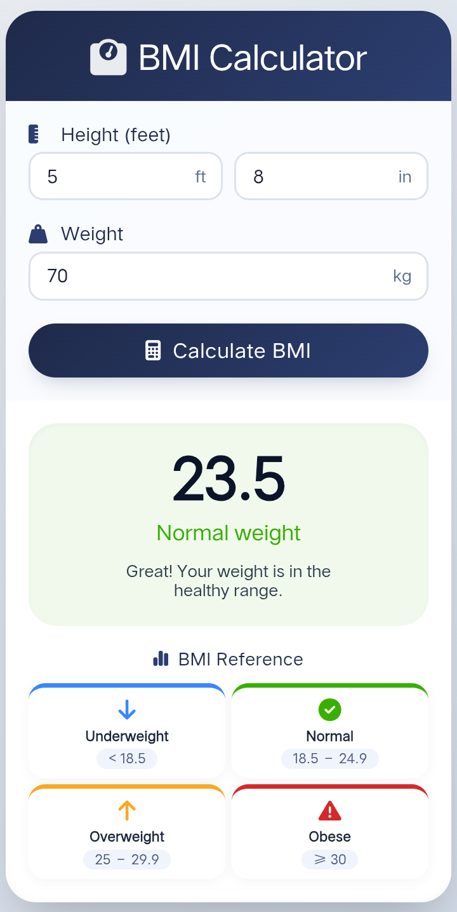

<div align="center">

  # 🏋️‍♂️ BMI Calculator

  **A clean, modern, and fully responsive Body Mass Index (BMI) calculator application built with HTML5, CSS3, and JavaScript.**

  [](https://github.com/sagorxzx/BMI_Calculator/stargazers)
  [](https://github.com/sagorxzx/BMI_Calculator/network/members)
  [](https://github.com/sagorxzx/BMI_Calculator/issues)
  [](LICENSE)

</div>

---

## 📌 About The Project

**BMI Calculator** is a responsive web application that enables users to calculate their **Body Mass Index (BMI)** instantly by providing their height (feet/inches) and weight (kg). It delivers accurate feedback and categorizes health status with an intuitive, clean interface.

---

## 📸 Screenshots

<div align="center">
  
  
  <br/><br/>
  
</div>

---

## ✨ Key Features

- ⚡ **Instant Calculation:** Real-time BMI calculation based on user input.
- 📱 **Responsive Design:** Optimized layout for both desktop and mobile screens.
- 🎨 **Visual Health Feedback:** Dynamic color-coded indicators representing health categories.
- 🚀 **Lightweight & Fast:** Built entirely using native web technologies with zero external frameworks.

---

## 🛠️ Tech Stack

- **Frontend:** HTML5, CSS3
- **Scripting:** JavaScript (ES6+)

---

## 📊 BMI Range Reference

| Category | BMI Range ($kg/m^2$) |
| :--- | :--- |
| 🔵 **Underweight** | $< 18.5$ |
| 🟢 **Normal Weight** | $18.5 - 24.9$ |
| 🟡 **Overweight** | $25.0 - 29.9$ |
| 🔴 **Obese** | $\ge 30.0$ |

---

## 🚀 Getting Started

To run this project locally, follow these simple steps:

1. **Clone the repository:**
   ```bash
   git clone [https://github.com/sagorxzx/BMI_Calculator.git](https://github.com/sagorxzx/BMI_Calculator.git)
