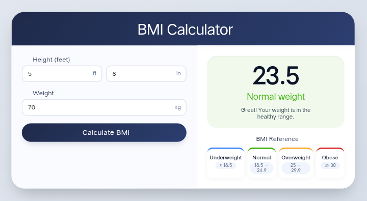
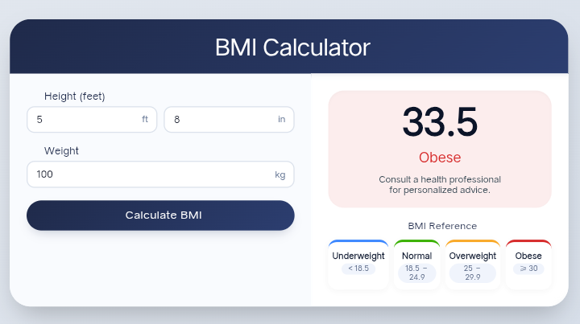

# BMI Calculator

A clean, modern, and responsive **Body Mass Index (BMI)** calculator web application built with HTML5, CSS3, and JavaScript. It provides instant BMI calculations based on height (feet/inches) and weight (kg) inputs, complete with visual category feedback and an interactive reference guide[cite: 1].


---

## 🚀 Live Demo

[**View Live Demo**](https://sagorxzx.github.io/BMI_Calculator/) *(Replace with your deployment URL)*

---

## ✨ Features

- **Instant BMI Calculation** — Get immediate BMI scores and category feedback upon calculation or pressing `Enter`[cite: 1].
- **Modern Glassmorphism UI** — Styled with a dark glassmorphism layout, smooth transitions, and dynamic visual indicators[cite: 1].
- **Dynamic Visual Feedback** — Result card dynamically shifts styles based on the calculated BMI category (Underweight, Normal, Overweight, Obese)[cite: 1].
- **Embedded Reference Guide** — Includes a built-in category breakdown for quick health assessment[cite: 1].
- **Fully Responsive** — Designed to seamlessly fit desktops, tablets, and mobile devices[cite: 1].
- **Fresh Session Start** — Opens with clean input fields for immediate use[cite: 1].

---

## 📸 Screenshots

| Desktop View | Mobile View |
| :---: | :---: |
|  |  |

<details>
<summary><b>View Additional Screenshots</b></summary>
<br />

| Normal Weight Result | Obese Result |
| :---: | :---: |
|  |  |

</details>

---

## 🛠️ Built With

- **HTML5** — Semantic structure[cite: 1]
- **CSS3** — Custom glassmorphism design, Flexbox, and CSS Grid[cite: 1]
- **JavaScript (ES6+)** — DOM manipulation, input handling, and calculation logic[cite: 1]
- **Font Awesome** — Vector icons for enhanced visuals[cite: 1]

---

## 📊 BMI Categories

| Category | BMI Range ($kg/m^2$) | Visual Indicator |
| :--- | :--- | :--- |
| **Underweight** | `< 18.5` | 🟦 Blue |
| **Normal Weight** | `18.5 - 24.9` | 🟩 Green |
| **Overweight** | `25.0 - 29.9` | 🟧 Orange |
| **Obese** | `≥ 30.0` | 🟥 Red |

---

## 📂 Project Structure

```text
BMI_Calculator/
├── index.html          # Main HTML structure
├── style.css           # Custom glassmorphism stylesheet
├── script.js           # Calculation logic & dynamic UI updates
├── screenshots/        # Application preview images
│   ├── desktop.png
│   └── mobile.png
└── README.md           # Project documentation
